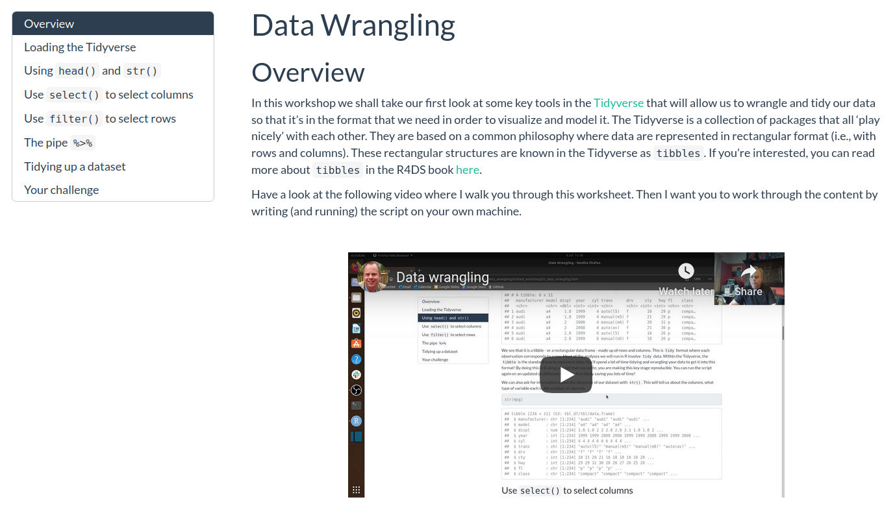

```{r setup, include=FALSE}
knitr::opts_chunk$set(echo = TRUE)
```

&nbsp;&nbsp;

Welcome to the Advanced Data Skills, Open Science and Reproducibility M.Res. unit BIOL63101. Click on the video below for a message from me and information about how this unit will run. 

&nbsp;&nbsp;

<center>

<iframe width="560" height="315" src="https://youtube.com/embed/3RsrQQu8yvk" frameborder="0" allowfullscreen></iframe>

</center>

&nbsp;&nbsp;

As well as being able to contact me via [email](mailto:drandrewjstewart@gmail.com) you can also contact me via our dedicated Slack channel. The details on how to join our Slack channel can be found on Blackboard. You can install the Slack app on your computer or phone - I recommend you do this as interacting with Slack via the app is really great. 

You can speak to me in one of the timetabled Zoom sessions (the details of those are on Blackboard) or via a personal meeting request - just ping me via email or Slack to request that. Additionally, you can follow me on [Twitter](https://twitter.com/ajstewart_lang?lang=en) where you'll see me tweet and re-tweet lots of Open Research and R content.

&nbsp; &nbsp;  
&nbsp;&nbsp;

# Workshop 1
## Open Research and Reproducibility

In this workshop I will first introduce you to the key concepts in open research, and talk about the so-called "replication crisis" in the Psychological, Biomedical, and Life Sciences that has resulted in the Open Research revolution. I will also discuss the importance of adopting reproducible research practices in your own research, and provide an introduction to various tools and processes you can incorporate into your own research workflows that will allow you to conduct reproducible research. To go to the first part of the workshop, just click on the image below.

<center>

&nbsp;  

[{width=75%}](https://ajstewartlang.github.io/01_open_research_and_reproducibility/knitted_workshop/01_open_research_and_reproducibility.html)

&nbsp; &nbsp;  

</center>

The second part of the workshop involves a very brief overview of open source software, the use of which is arguably key for researchers to be able to adopt open and reproducible research workflows. To view this second part, just click on the image below.

<center>

&nbsp;  

[{width=75%}](https://ajstewartlang.github.io/24_open_source/knitted_workshop/24_open_source.html)

&nbsp; &nbsp;  

</center>

&nbsp;&nbsp;

# Workshop 2 
## Starting with R and RStudio Desktop

In this workshop I'll introduce you to R (the language) and RStudio Desktop (the environment we use to interact with the language). I've also added a link to a great talk by the founder of RStudio, J.J. Alaire. At the end of the workshop I have put together a video which will allow you to run your first R script.

<center>

&nbsp;  

[{width=75%}](https://ajstewartlang.github.io/02_starting_with_r/knitted_workshop/02_starting_with_r.html)

&nbsp; &nbsp;  

</center>

&nbsp;&nbsp;

# Workshop 3
## Data Wrangling

In this workshop I will introduce you to a number of key packages known as the `Tidyverse` packages. These packages contain a large number of functions for working with data in tidy format. By making our data wrangling reproducible (i.e., by coding it in R), we can easily re-run this stage of our analysis pipeline as new data gets added. Reproducibility of the data wrangling stage is a key part of the analysis process and often gets overlooked in terms of it being reproducible. There are two parts to this workshop. The first focuses on data wrangling/tidying. To go to this first part, just click on the image below.

<center>

&nbsp;  

[{width=75%}](https://ajstewartlang.github.io/03_data_wrangling/knitted_workshop/03_data_wrangling.html)

&nbsp;  

</center>

&nbsp;&nbsp;

## Summarising Your Data

Once you have completed this first part and have your R script up and running, click on the image below for the second part where you'll learn how to aggregate and summarise your data.  

<center>

&nbsp;  

[{width=75%}](https://ajstewartlang.github.io/04_summarising_your_data/knitted_workshop/04_summarising_your_data.html)

&nbsp; &nbsp;  

</center>

&nbsp;&nbsp;

# Workshop 4
## Data Visualisation

We will now move on to explore the basics of Data Visualization using R. Just click on the image below to start.  

<center>

&nbsp;  

[{width=75%}](https://ajstewartlang.github.io/06_data_visualisation/knitted_workshop/06_data_visualisation)

&nbsp;  

</center>

&nbsp;&nbsp;

# Workshop 5
## GLM - Simple Linear Regression

We will now move on to explore Simple Regression in the context of the General Linear Model (GLM).

<center>

&nbsp;  

[{width=75%}](https://ajstewartlang.github.io/09_glm_regression_pt1/knitted_workshop/09_glm_regression_pt1.html)

&nbsp;  

</center>

&nbsp;&nbsp;

# Workshop 6
## GLM - Multiple Regression

We will now move on to explore Multiple Regression in the context of the General Linear Model (GLM).

<center>

&nbsp;  

[{width=75%}](https://ajstewartlang.github.io/10_glm_regression_pt2/knitted_workshop/10_glm_regression_pt2.html)

&nbsp;  

</center>

&nbsp;&nbsp;

