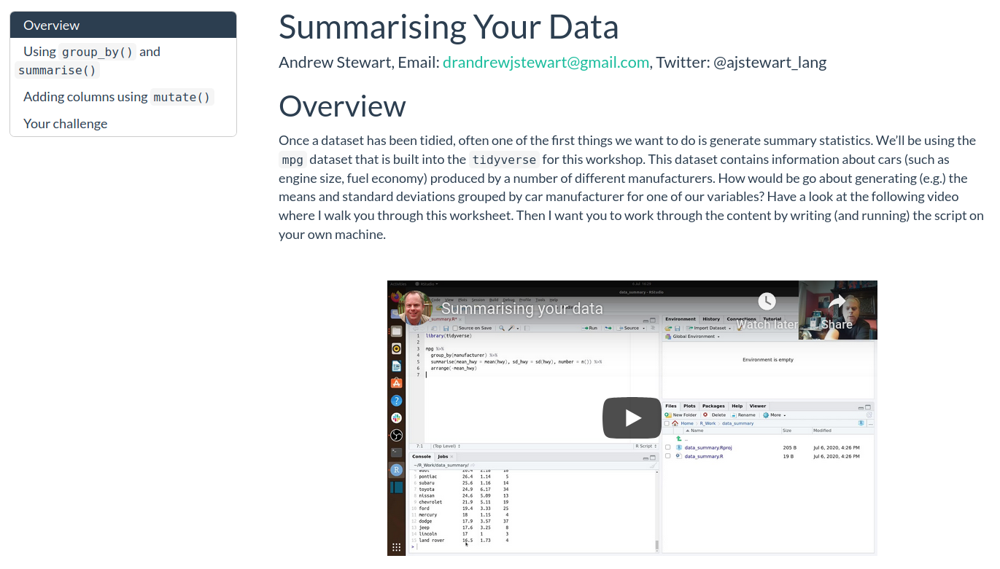
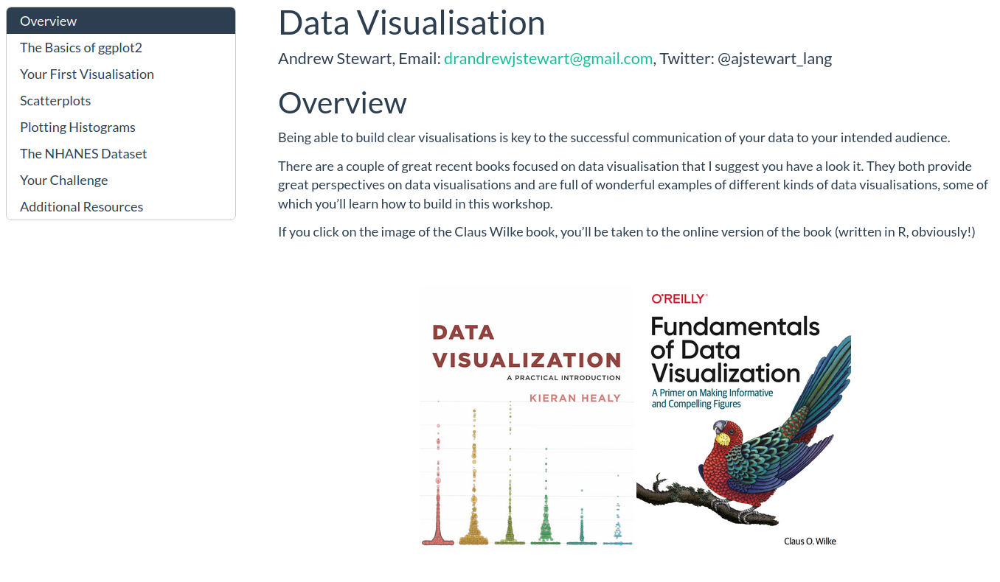
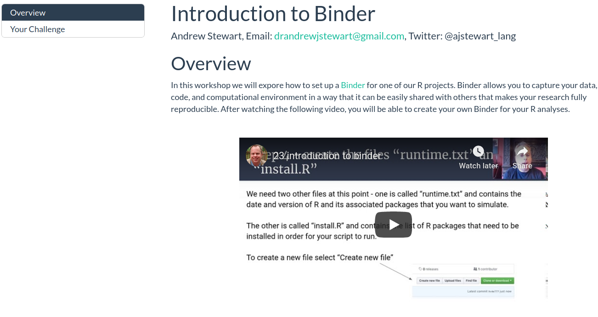

```{r setup, include=FALSE}
knitr::opts_chunk$set(echo = TRUE)
```

  

Welcome to the Advanced Data Skills, Open Science and Reproducibility M.Res. unit BIOL63101. The following video (as with all the others in this unit) is best viewed in fullscreen mode at 1080 resolution. I have recorded the audio with a podcasting microphone, so it's best listened to with headphones. YouTube generates subtitles automatically, so please turn those in if you'd find them useful.

Click on the video below for a message from me. I'll be teaching this unit via a flipped classroom model. Make sure you go through the recorded content for each workshop in advance of the live session for that workshop. The live session will take place either in person, or on Zoom (depending on how the whole Covid situation is). Either way it is important to remember that you go through the recorded content in advance of the live session. 

  

<center>

<iframe width="560" height="315" src="https://youtube.com/embed/f8brespcW48" frameborder="0" data-external="1" allowfullscreen>

</iframe>

</center>

  

As well as being able to contact me via [email](mailto:drandrewjstewart@gmail.com) you can also contact me via our dedicated Slack channel. The details on how to join our Slack channel can be found on Blackboard. You can install the Slack app on your computer or phone - I recommend you do this as interacting with Slack via the app is really great.

You can follow me on [Twitter](https://twitter.com/ajstewart_lang?lang=en) where you'll see me tweet and re-tweet lots of Open Research and R content.

There are two assignments associated with this unit. The full details of these (plus hand in dates) can be found on the Blackboard page for this Unit.

   \
  

# Workshop 1

## Open Research and Reproducibility

In this workshop I will first introduce you to the key concepts in open research, and talk about the so-called "replication crisis" in the Psychological, Biomedical, and Life Sciences that has resulted in the Open Research movement I will also discuss the importance of adopting reproducible research practices in your own research, and provide an introduction to various tools and processes you can incorporate into your own research workflows that will allow you to conduct reproducible research. To go to the first part of the workshop, just click on the image below.

<center>

 

[{width="75%"}](https://ajstewartlang.github.io/01_open_research_and_reproducibility/knitted_workshop/01_open_research_and_reproducibility.html)

   

</center>

## Experimental Power

The second part of this workshop covers experimental power (and why it is important). One of the insights revealed by the "replication crisis" is that very often research is underpowered for the effect size of interest (i.e., even if the effect is there, your experiment is unlikely to find it). Many of the issues stem from researchers not spending sufficient time considering the power aspects of their research design. In this workshop, I'll provide you with an overview of some of the issues - just click on the image below to view this second part of the workshop:

<center>

 

[{width="75%"}](https://ajstewartlang.github.io/13_experimental_power/knitted_workshop/13_experimental_power.html)

   

</center>

## Open Source Software

The third part of the workshop involves a very brief overview of open source software, the use of which is arguably key for researchers to be able to adopt open and reproducible research workflows. To view this third part, just click on the image below.

<center>

 

[{width="75%"}](https://ajstewartlang.github.io/24_open_source/knitted_workshop/24_open_source.html)

   

</center>

  

# Workshop 2

## Starting with R and RStudio Desktop

In this workshop I'll introduce you to R (the language) and RStudio Desktop (the environment we use to interact with the language). I've also added a link to a great talk by the founder of RStudio, J.J. Alaire. At the end of the workshop I have put together a video which will show you how to run your first R script.

<center>

 

[{width="75%"}](https://ajstewartlang.github.io/02_starting_with_r/knitted_workshop/02_starting_with_r.html)

   

</center>

  

# Workshop 3

## Data Wrangling

In this workshop I will introduce you to a number of key packages known as the `Tidyverse` These packages contain a large number of functions for working with data in tidy format. By making our data wrangling reproducible (i.e., by coding it in R), we can easily re-run this stage of our analysis pipeline as new data gets added. Reproducibility of the data wrangling stage is a key part of the analysis process and often gets overlooked in terms of needing to ensure it is reproducible. There are two parts to this workshop. The first focuses on data wrangling/tidying. To go to this first part, just click on the image below.

<center>

 

[{width="75%"}](https://ajstewartlang.github.io/03_data_wrangling/knitted_workshop/03_data_wrangling.html)

 

</center>

  

## Summarising Your Data

Once you have completed this first part and have your R script up and running, click on the image below for the second part where you'll learn how to aggregate and summarise your data.

<center>

 

[{width="75%"}](https://ajstewartlang.github.io/04_summarising_your_data/knitted_workshop/04_summarising_your_data.html)

   

</center>

  

# Workshop 4

## Data Visualisation

In this workshop we will explore the basics of Data Visualization using R. You'll have the opportunity to write an R script on your own computer that will generate some nice data visualisations. Just click on the image below to start.

<center>

 

[{width="75%"}](https://ajstewartlang.github.io/06_data_visualisation/knitted_workshop/06_data_visualisation)

 

</center>

  

# Workshop 5

## R Markdown

In this workshop I will show you how to generate a report in `.html` format using R Markdown. Reports written using R Markdown allow you to combine narrative that you've written alongwith R code chunks, and the output associated with those code chunks all in one `knitted` document. The assignments for this unit need to be produced using R Markdown.

<center>

 

[{width="75%"}](https://ajstewartlang.github.io/19_introduction_to_r_markdown/knitted_workshop/19_introduction_to_r_markdown.html)

 

</center>

  

# Workshop 6

## Regression Part 1

In this workshop we will explore Simple Regression in the context of the General Linear Model (GLM). You will also have the opportunity to build some regression models where you predict an outcome variable on the basis of one predictor. You will also learn how to run model diagnostics to ensure you are not violating any key assumptions of regression.

<center>

 

[{width="75%"}](https://ajstewartlang.github.io/09_glm_regression_pt1/knitted_workshop/09_glm_regression_pt1.html)

 

</center>

  

# Workshop 7

## Regression Part 2

In this workshop will explore Multiple Regression in the context of the General Linear Model (GLM). Multiple Regressions builds on Simple Regression, except that having one predictor (as is the case with Simple Regression) we will be dealing with multiple predictors. Again, you will have the opporunity to build some regression models and use various methods to decide which one is 'best'. You will also learn how to run model disagnostics for these models as you did in the case of Simple Regression.

<center>

 

[{width="75%"}](https://ajstewartlang.github.io/10_glm_regression_pt2/knitted_workshop/10_glm_regression_pt2.html)

 

</center>

  

# Workshop 8

## ANOVA Part 1

In this workshop we will explore Analysis of Variance (ANOVA) in the context of model building in R for between participants designs, repeated measures designs, and factorial designs. You will learn how to use the {afex} package for building models with Type III Sums of Squares, and the {emmeans} package to conduct follow up tests to explore main effects and interactions.

<center>

 

[{width="75%"}](https://ajstewartlang.github.io/11_glm_anova_pt1/knitted_workshop/11_glm_anova_pt1.html)

 

</center>

  

# Workshop 9

## ANOVA Part 2

In this workshop we will build on Workshop 8 to explore Analysis of Covariance (ANCOVA). In this workshop we will also examine ANOVA and ANCOVA as special cases of regression and see how we can build both via a linear model. By then doing this yourselves, you wil hopefully be convinced that ANOVA and regression are really the same thing.

<center>

 

[{width="75%"}](https://ajstewartlang.github.io/12_glm_anova_pt2/knitted_workshop/12_glm_anova_pt2.html)

 

</center>

  

# Workshop 10

This workshop will introduce you to Binder, a tool for allowing you to reproduce your computational environment, as well as your code and data, and share all of these with a collaborator via sharing a simple web link.

<center>

 

[{width="75%"}](https://ajstewartlang.github.io/23_introduction_to_binder/knitted_workshop/23_introduction_to_binder.html)

 

</center>

  

## Technical Details

All of the material in this workshop was created using open source where possible using an [Entroware Apollo laptop](https://www.entroware.com/store/) running [GNU/Linux distro Ubuntu 20.04 LTS (Focal Fossa)](https://releases.ubuntu.com/20.04/). The audio was captured with a [Fifine USB Podcasting microphone](https://www.amazon.co.uk/Condenser-Microphone-Recording-Interface-Power-K669/dp/B01N034RTC/ref=sr_1_1_sspa?crid=141Z8ED4VGCVD&dchild=1&keywords=fifine+usb+podcast+condenser+microphone&qid=1594989611&sprefix=fifne+usb%2Caps%2C162&sr=8-1-spons&psc=1&spLa=ZW5jcnlwdGVkUXVhbGlmaWVyPUFFMzAxOE5DUDJIREwmZW5jcnlwdGVkSWQ9QTA4MzA2NjIxVU40MlhNMFNCTDhWJmVuY3J5cHRlZEFkSWQ9QTA5NDI2OTQxOFY0R002UVJBS1AzJndpZGdldE5hbWU9c3BfYXRmJmFjdGlvbj1jbGlja1JlZGlyZWN0JmRvTm90TG9nQ2xpY2s9dHJ1ZQ==) and the video with a [Razer Kiyo webcam](https://www.amazon.co.uk/Razer-Streaming-Adjustable-Brightness-Microphone/dp/B076QK6489/ref=sr_1_3?dchild=1&keywords=razer+kiyo&qid=1594989677&sr=8-3). The audio and video were recorded using [Open Broadcast Software](https://obsproject.com/) and edited using [Shotcut](https://shotcut.org/). The R code was written using [R 3.6.3](https://www.r-project.org/), and run in the [RStudio Desktop IDE](https://rstudio.com/products/rstudio/download/) version 1.3.959. Ubuntu 20.04 LTS (Focal Fossa), OBS, Shotcut, R, and RStudio Desktop are all [open source](https://en.wikipedia.org/wiki/Open-source_software).

The structure for this unit was very much inspired by the [Sharing At Short Notice](https://rstudio.com/resources/webinars/sharing-on-short-notice-how-to-get-your-materials-online-with-r-markdown/) webinar by Alison Hill and Desirée De Leon.

The repo for each workshop can be accessed via the 'Improve this Workshop' link at the bottom of each workshop page. The workshops and this website were all written using [R Markdown](https://rmarkdown.rstudio.com/) and the website is hosted on [Netlify](https://www.netlify.com/) via continunous deployment from [this GitHub repository](https://github.com/ajstewartlang/MRes_BIOL63101).

The source code for each of the Workshops above is licensed under the [MIT license](https://opensource.org/licenses/MIT), and the lecture content under [CC-BY](https://creativecommons.org/licenses/by/4.0/).
